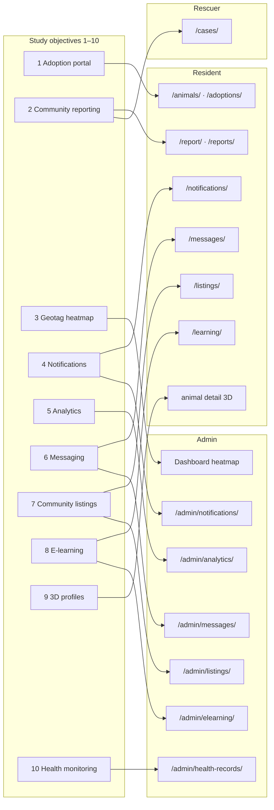
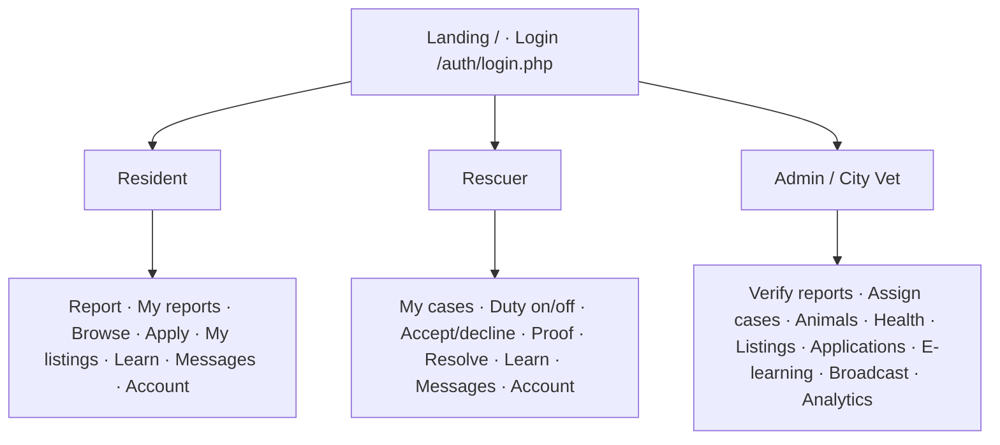
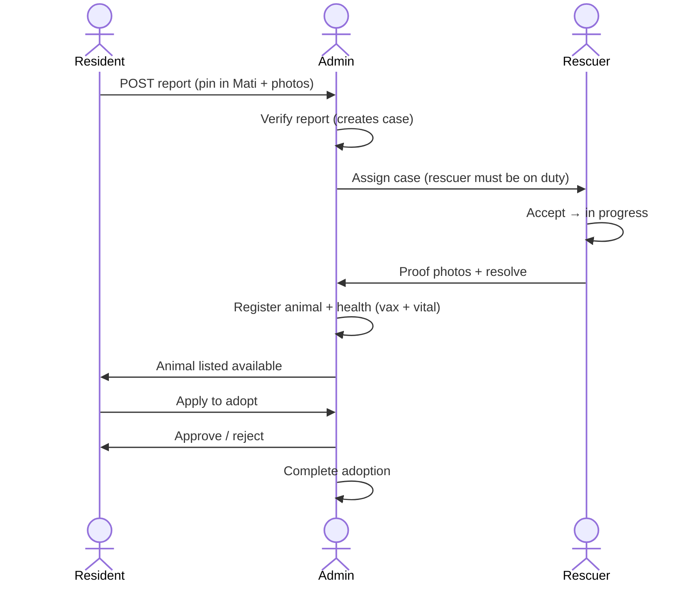
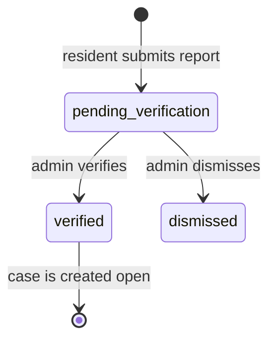
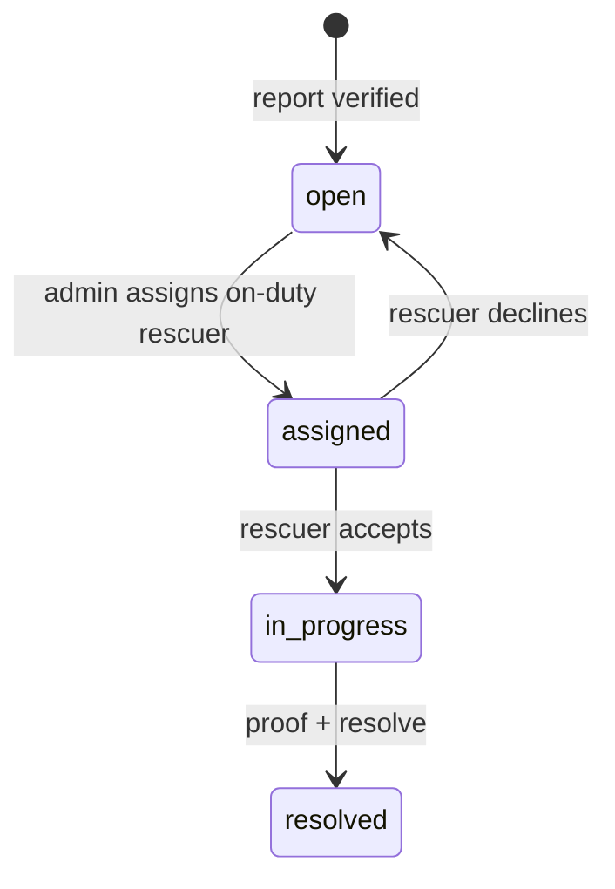
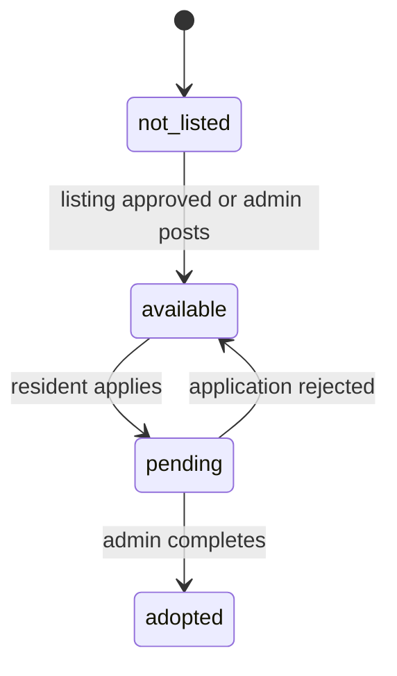

# FurEscue — Objective map and role workflows

Open this file in Cursor (preview) to see the diagrams. Use it while clicking through the live app at `http://127.0.0.1:8000`.

Seeded password for every demo account: **`Password123!`**

| Role | Login | Home after login |
|------|--------|------------------|
| Resident | `juan@furescue.local` | `/reports/` |
| Rescuer | `rescuer@furescue.local` | `/cases/` |
| Admin | `admin@furescue.local` | `/admin/` |
| Pending rescuer | `rescuer6@furescue.local` | blocked until admin approves |

---

## 1. Study objectives → where they live

From [OBJECTIVES.md](../study/OBJECTIVES.md). Each row is one specific aim of the study.

| # | Objective | Who | Pages to click | Status chain |
|---|-----------|-----|----------------|--------------|
| 1 | Adoption portal | Resident, admin | `/animals/`, `/animals/detail.php?id=…`, `/adoptions/`, `/admin/applications/` | animal `available` → apply `pending` → `approved` / `rejected` → `completed` |
| 2 | Community reporting | Resident, admin, rescuer | `/report/`, `/reports/`, `/admin/reports/`, `/cases/` | report `pending_verification` → `verified` / `dismissed` |
| 3 | Geotag heatmap | Admin | `/admin/` map (verified pins, Mati bounds) | only **verified** reports heat |
| 4 | Notifications (near real-time) | All signed-in | `/notifications/`, `/admin/notifications/` | EventSource stream + inbox; admin can broadcast |
| 5 | Analytics / exports | Admin | `/admin/analytics/` | CSV downloads; date range on trends / health |
| 6 | In-app messaging | All signed-in | `/messages/`, `/admin/messages/` | Thread on a report, case, or adoption |
| 7 | Community post-for-adoption | Resident, admin | `/listings/`, `/admin/listings/` | listing `pending_review` → `approved` / `rejected` |
| 8 | E-learning | Resident/rescuer, admin | `/learning/`, `/admin/elearning/` | draft / published; progress not_started → completed |
| 9 | 3D profiling | Admin upload, resident view | `/admin/animals/`, animal detail **View in 3D** | `model_3d_url` / 360 set |
| 10 | Health monitoring | Admin | `/admin/health-records/`, per-animal record | vaccines + vitals required before listing |

---

## 2. Who does what (roles)

Residents never see **My Cases**. Rescuers never see **Report / Browse / My Adoptions / My Listings**. Admins use `/admin/…`.

---

## 3. Main lifecycle (one animal, three roles)

This is the story the paper’s IPO model is about: input (report) → process (verify, rescue, care) → output (adopted).

Walk this in the browser, in order:

1. Resident → `/report/` → submit.
2. Admin → `/admin/reports/` → Verify → `/admin/cases/` → Assign `rescuer@…`.
3. Rescuer → `/cases/` → On duty → Accept → proof → Resolve.
4. Admin → `/admin/animals/` + `/admin/health-records/` → list for adoption.
5. Resident → `/animals/` → Apply → `/adoptions/`.
6. Admin → `/admin/applications/` → Approve → later Complete.

---

## 4. Status machines

A listing cannot go live until the animal has **at least one vaccination row and one vital** (health-ready gate).

---

## 5. Page map (URLs)

### Public / auth

| URL | Who |
|-----|-----|
| `/` | Everyone (marketing) |
| `/auth/login.php` | Everyone |
| `/auth/signup.php` | New resident or rescuer applicant |

### Resident portal

| URL | Objective |
|-----|-----------|
| `/report/` | 2 |
| `/reports/` | 2, 4 |
| `/animals/` · `/animals/detail.php?id=` | 1, 9 |
| `/adoptions/` | 1 |
| `/listings/` | 7 |
| `/learning/` | 8 |
| `/messages/` | 6 |
| `/notifications/` | 4 |
| `/account/` | profile (not a numbered objective) |

### Rescuer portal

| URL | Objective |
|-----|-----------|
| `/cases/` · `/cases/detail.php?id=` | 2 (operations) |
| `/learning/` · `/messages/` · `/notifications/` · `/account/` | 8, 6, 4 |

### Admin console

| URL | Objective |
|-----|-----------|
| `/admin/` | 3, queues |
| `/admin/reports/` | 2 |
| `/admin/cases/` | 2 |
| `/admin/rescuers/` | staff gate |
| `/admin/animals/` | 1, 9 |
| `/admin/health-records/` | 10 |
| `/admin/listings/` | 7 |
| `/admin/applications/` | 1 |
| `/admin/elearning/` | 8 |
| `/admin/messages/` | 6 |
| `/admin/notifications/` | 4 |
| `/admin/analytics/` | 5 |

---

## 6. Conceptual framework (IPO) vs this map

[CONCEPTUAL_FRAMEWORK.md](../study/CONCEPTUAL_FRAMEWORK.md) is Input → Process → Output.

| IPO | In this system |
|-----|----------------|
| **Input** | Reports, applications, health notes, map pins |
| **Process** | Dedup + Mati bounds, verify, assign, duty check, health-ready listing, approve/reject |
| **Output** | Heatmap, case list, adoption gallery, analytics CSV, notifications, 3D profile |

If a step is empty on screen, the previous status was never reached (example: assign dialog empty → no rescuer is **on duty**).
